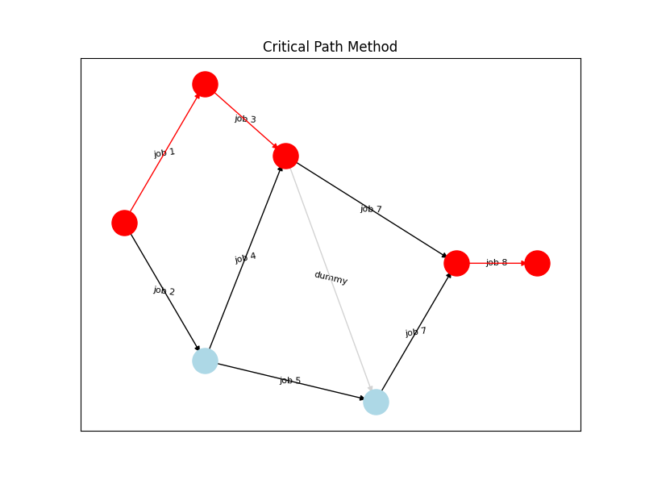

# Scheduling Theory - Critical Path Method (CPM)
This project implements the Critical Path Method (CPM), a popular algorithm in scheduling theory. CPM is commonly used in project management for scheduling a set of project activities.

## Files

- `CPM.py`: This file contains the implementation of the CPM algorithm, with classes defined for Job and Network, and various functions for calculating earliest times, latest times, slacks and the critical path.

- `visualize.py`: This file contains the code for visualizing the network of jobs using networkx and matplotlib. It creates a directed graph based on job states and illustrates critical and non-critical paths in the project network. The output is saved as a PNG file.

- `main.py`: This is the main script that you run to execute the program. It defines the jobs and dependencies, creates the network, runs the CPM algorithm, prints the results, and visualizes the job network.

## Usage

To use this program, you must first provide a json file with the job data.
Here is an example of the data file format:

```json
{
    "1": { "id": "1", "duration": 4, "predecessors": [] },
    "2": { "id": "2", "duration": 6, "predecessors": [] },
    "3": { "id": "3", "duration": 10, "predecessors": [] },
    "4": { "id": "4", "duration": 12, "predecessors": [1] },
    "5": { "id": "5", "duration": 10, "predecessors": [2] },
    "6": { "id": "6", "duration": 2,"predecessors": [3, 4, 5] },
    "7": { "id": "7", "duration": 4, "predecessors": [3, 4] },
    "8": { "id": "8", "duration": 2, "predecessors": [6, 7] }
}
```

To run the program, execute the main.py script. Make sure you have all the required dependencies installed.

```bash
python main.py 'input_filename' 'output_directory'
```
The program will read the `.json` file and runs `CPM`. You should see the output of the CPM algorithm in the console, and a PNG file named `CPM.png` will be created in the output directory, visualizing the job network.



## Dependencies

This project requires the following Python libraries:

- `networkx`
- `matplotlib`
- `pygraphviz`
- `collections`
