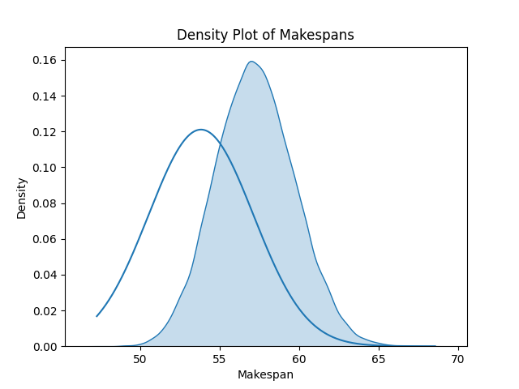
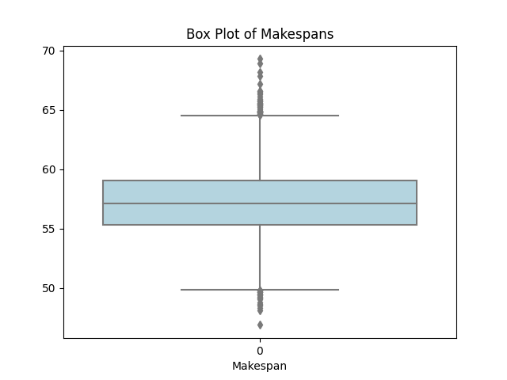
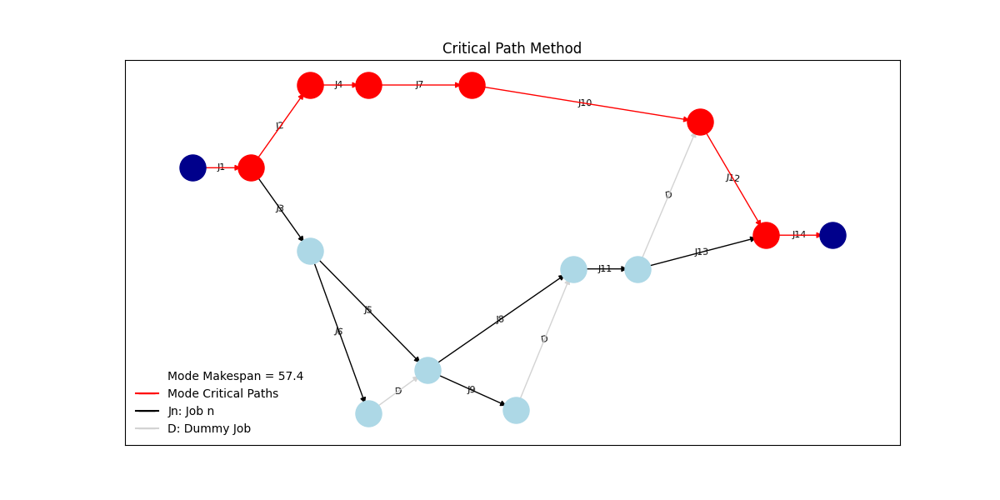

# Scheduling Theory - Project Evaluation and Review Technique (PERT)
This project provides an implementation of the Project Evaluation and Review Technique (PERT), a statistical tool used in project management that is designed to analyze and represent the tasks involved in completing a given project.


## Files

- `CPM.py`: This file contains the implementation of the CPM algorithm, with classes defined for Job and Network, and various functions for calculating earliest times, latest times, slacks, and the critical path.

- `job_PERT.py`: This file extends the Job class in CPM.py to include the variance of the duration of each job, a key aspect in PERT analysis.

- `visualize.py`: This file contains the code for visualizing the network of jobs using networkx and matplotlib. It creates a directed graph based on job states and illustrates critical and non-critical paths in the project network. The output is saved as a PNG file.

- `main.py`: This is the main script that you run to execute the program. It reads the job data from a json file, creates the network, runs the PERT analysis, and visualizes the job network.

## Usage

To use this program, you must first provide a csv file with the job data.
Here is an example of the data file format:

```csv
| id | optimistic | most_likely | pessimistic | predecessors |
|---:|-----------:|------------:|------------:|:-------------|
|  1 |          2 |           5 |           6 | []           |
|  2 |          2 |           6 |           9 | [1]          |
|  3 |          4 |           9 |          10 | [1]          |
|  4 |          5 |          12 |          18 | [2]          |
|  5 |          1 |           7 |           8 | [3]          |
|  6 |          5 |          12 |          16 | [3]          |
|  7 |          9 |          10 |          11 | [4]          |
|  8 |          5 |           6 |          10 | [5, 6]       |
|  9 |          3 |          10 |          15 | [5, 6]       |
| 10 |          9 |           9 |          20 | [7]          |
| 11 |          5 |           7 |           9 | [8, 9]       |
| 12 |          3 |           8 |          10 | [10, 11]     |
| 13 |          6 |           7 |          14 | [11]         |
| 14 |          4 |           5 |           7 | [12, 13]     |
```

Each job is represented by a dictionary where the key is the job id and the value is another dictionary with the job's properties. The job's properties include its duration, an array of its predecessors (other jobs that need to be completed before this job can start), and the variance in the duration of the job.

To run the program, execute the main.py script with the path to your json file and the directory where the output files will be saved as arguments:

```bash
python main.py 'input_filename' 'output_directory'
```

The program will perform a PERT analysis on the job data and output the results as a network diagram showing the jobs and their dependencies, as well as a density plot and a box plot showing the distribution of makespans (the total time required to complete the project). The network diagram and density plot are saved as PNG files in the specified output directory.





## Dependencies

This project requires the following Python libraries:

- `numpy`
- `seaborn`
- `networkx`
- `matplotlib`
- `pygraphviz`
- `collections`
- `json`
